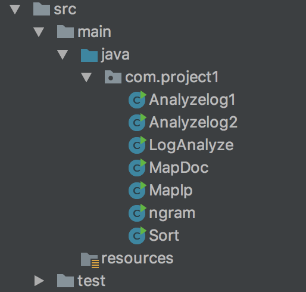

## READ ME

Name node: 159.89.33.2

User: root

password: Jinruoyu123

### Execute the shell script

```
start-all.sh
. ~/project1/project1.sh
```

###package name: com.project1

###project structure:



###Part3

Generate data: 

\#generate data

```
hadoop jar $HADOOP_HOME/share/hadoop/mapreduce/hadoop-mapreduce-examples-2.7.5.jar randomtextwriter -Dmapreduce.randomtextwriter.totalbytes=10240 /data/ngram/test_big
```

java class: ngram

function description:

* Main: Create a new Instance of Job object;
  * Set n of ngram arg[0] and put it into configuration;
  * Set mapper class;
  * Set reducer class;
  * Set Output key/value;
  * Set Input filepath args[1];
  * Set Input filepath args[2];
* Mapper:
  * Setup function: get n from configuration;
  * Map function: 
    * tokenize input word by StringTokenizer;
    * iteratively get the input by nextToken;
    * divide the word into ngram with the parameter n and write (word,1) to context.
* Reducer:
  * Get total frequency of each ngram part of characters.
  * write (word,frequence) to context.

### Part4:

#### Q1:

​	java class: Analyzelog1

* Main: Create a new Instance of Job object;
  * Set mapper class;
  * Set reducer class;
  * Set Output key/value;
  * Set Input filepath args[0];
  * Set Input filepath args[1].
* Mapper:
  - Map function: 
    - tokenize input word by StringTokenizer;
    - iteratively get the input by nextToken;
    - use pattern matcher to separate one log into %h %l %u %t \"%r\" %>s %b.
    - get the path equal to specific path in matcher.group(5).
    - write (word,1) to context
* Reducer:
  * Get total frequency of the specific Path.
  * write (word,frequence) to context.

#### Q2:

​	java class: Analyzelog1

- Main: Create a new Instance of Job object;
  - Set mapper class;
  - Set reducer class;
  - Set Output key/value;
  - Set Input filepath args[0];
  - Set Input filepath args[1].
- Mapper:
  - Map function: 
    - tokenize input word by StringTokenizer;
    - iteratively get the input by nextToken;
    - use pattern matcher to separate one log into %h %l %u %t \"%r\" %>s %b.
    - get the path equal to specific IP in matcher.group(1).
    - write (word,1) to context
- Reducer:
  - Get total frequency of the specific IP.
  - write (word,frequence) to context.

#### Q3:

##### First phase get all paths:

​	java class: MapDoc

* Main: Create a new Instance of Job object;
  * Set mapper class;
  * Set reducer class;
  * Set Output key/value;
  * set sort comparator
  * Set Input filepath args[0];
  * Set Input filepath args[1].
* Mapper:
  * Map function: 
    * tokenize input word by line;
    * use pattern matcher `"(?<=GET).*?(?=HTTP)"`to get file path.
    * write (word,1) to context
* Reducer:
  - Get total frequency of each path.
  - write (word,frequence) to context.

##### Second phase rank the result:

​	java class: Sort

* Main: Create a new Instance of Job object;
  * Set mapper class;
  * Set reducer class;
  * Set Output key/value;
  * **setSortComparatorClass;**
  * Set Input filepath args[0];
  	 Set Input filepath args[1].	
* Mapper:
  * Map function: 
    - tokenize input text by delimeter " ";
    - exchange the key and value;
    - write(value,key) to context.
  * Reconstruct class My Comparator: 
    * Reconstruct two compare function and use it to sort the output into Descending order.
  * Reduce function:
    * just write the (value,key) to context.

#### Q4:

##### First phase get all paths:

​	java class: MapIp

- Main: Create a new Instance of Job object;
  - Set mapper class;
  - Set reducer class;
  - Set Output key/value;
  - set sort comparator
  - Set Input filepath args[0];
  - Set Input filepath args[1].
- Mapper:
  - Map function: 
    - tokenize input word by line;
    - use pattern matcher `"(\\d{1,3}\\.\\d{1,3}\\.\\d{1,3}\\.\\d{1,3})"` to get IP address;
    - write (word,1) to context.
- Reducer:
  - Get total frequency of each IP address;
  - write (word,frequence) to context.

##### Second phase rank the result:

​	java class: Sort

​	

